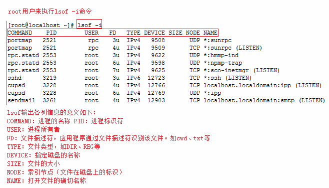

# lsof

更多参考: <https://www.yiibai.com/linux/lsof.html>

**lsof** (list open files)是一个列出当前系统打开文件的工具。

**lsof** 查看端口占用语法格式：

```shell
lsof -i:port
```

**实例:**

查看服务器 `8000` 端口的占用情况：

```python
# lsof -i:8000
COMMAND   PID USER   FD   TYPE   DEVICE SIZE/OFF NODE NAME
nodejs  26993 root   10u  IPv4 37999514      0t0  TCP *:8000 (LISTEN)
# 可以看到 8000 端口已经被轻 nodejs 服务占用。
```

`lsof -i` 需要 `root` 用户的权限来执行，如下图：



更多 `lsof` 的命令如下：

- **lsof -i:8080**：查看`8080`端口占用
- **lsof abc.txt**：显示开启文件`abc.txt`的进程
- **lsof -c abc**：显示`abc`进程现在打开的文件
- **lsof -c -p 1234**：列出进程号为`1234`的进程所打开的文件
- **lsof -g gid**：显示归属`gid`的进程情况
- **lsof +d /usr/local/**：显示目录下被进程开启的文件
- **lsof +D /usr/local/**：同上，但是会搜索目录下的目录，时间较长
- **lsof -d 4**：显示使用`fd`为`4`的进程
- **lsof -i -U**：显示所有打开的端口和`UNIX domain`文件
